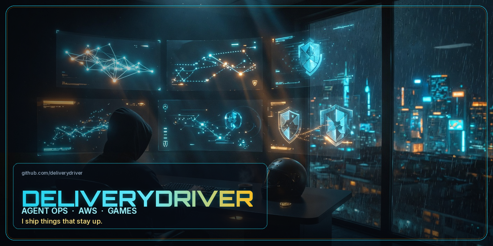
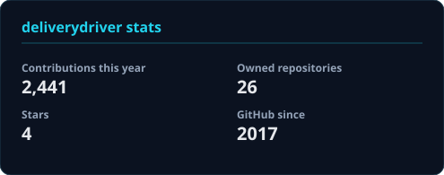
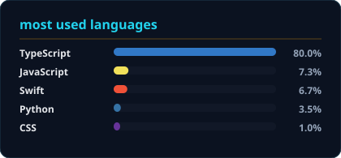

<p align="center">
  
</p>

<h3 align="center">I ship things that stay up.</h3>

<p align="center">
  
</p>

<p align="center">
  
  
  
  
</p>

<p align="center">
  
</p>

## About

**I build the boring-hard parts around AI agents** — the runtime, the guardrails, the landing zone — then I ship a poker table for friends.

- Building **[OpenShield](https://github.com/deliverydriver/openshield)** — one command to run OpenClaw on Docker or Kubernetes with a security hook layer (`npx openshield@latest init`)
- Designing **AWS foundations for agentic systems** — multi-account landing zones, Well-Architected reviews, voice/autonomous agent platforms, sovereign patterns
- Comfortable in **TypeScript, Python, Terraform, Docker, Kubernetes, AWS**
- Shipping **play-money Texas Hold'em** with a live equity HUD
- Tinkering on **XRPL / Xumm** SDKs
- GitHub since **2017**. **Hireable.**

Security is a runtime property, not a slide.

## Currently

<p align="center">


</p>

---

## Featured projects

<table>
<tr>
<td width="50%" valign="top" align="center">

### OpenShield

**Security layer for AI agent runtimes**

One command to run OpenClaw on Docker or Kubernetes, with exec-policy presets, security hooks, and local JSONL audit logs. No dashboard tax.

`cautious` · `yolo` · `deny-all`

<p>


</p>

<a href="https://openshield.cc"></a>
<a href="https://github.com/deliverydriver/openshield"></a>

</td>
<td width="50%" valign="top" align="center">

### AWS Well-Architected AI

**Reference architectures for agentic systems**

Operational reviews for long-running agents, voice interfaces, secure tool use, and RAG at scale — judged by real load, cost, and incidents, not diagrams.

<p>


</p>

<a href="https://github.com/deliverydriver/aws-well-architected-ai"></a>

</td>
</tr>
<tr>
<td width="50%" valign="top" align="center">

### AWS Landing Zone for AI

**Multi-account foundation for agentic workloads**

OU structure, SCPs, PrivateLink, and cost attribution that survive agent delegation. Research vs production vs data planes without two separate foundations.

<p>


</p>

<a href="https://github.com/deliverydriver/aws-landing-zone-for-ai"></a>

</td>
<td width="50%" valign="top" align="center">

### Best of Friends Table Games

**Play-money Texas Hold'em for friends**

Private rooms, AI seat fill, live equity HUD (win / tie / lose, outs, pot odds). No casino chrome. No real-money gambling.

<p>


</p>

<a href="https://spades.spacecoast.cc"></a>
<a href="https://github.com/deliverydriver/best-of-friends-table-games"></a>

</td>
</tr>
</table>

<p align="center">
Also in the same AWS set:
<a href="https://github.com/deliverydriver/aws-agent-platform">aws-agent-platform</a>
·
<a href="https://github.com/deliverydriver/aws-sovereign-infrastructure">aws-sovereign-infrastructure</a>
·
<a href="https://github.com/deliverydriver/pizzabuilder-js">pizzabuilder-js</a>
</p>

---

## Skills

### Languages

<p>

</p>

### Full stack

<p>

</p>

### Cloud, infra, security

<p>

</p>

### Tools

<p>

</p>

<p>


</p>

---

## Loadout

```
┌──────────────────────────────────────────────┐
│  CLASS     Agent operator / infra           │
│  SPAWN     2017                             │
│  VEHICLE   whatever gets the deploy there   │
│  HP        caffeine                         │
│  POLICY    cautious (yolo on Fridays)       │
│  QUEST     ship things that stay up         │
└──────────────────────────────────────────────┘
```

---

## GitHub

<p align="center">
  
  
</p>

<p align="center">
  
</p>

---

<p align="center">
  <b>Keep shipping. Keep the runtime honest. Keep the table friendly.</b>
</p>

<p align="center">

</p>
